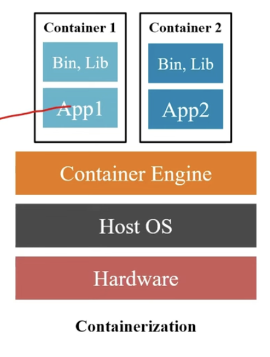

# Simple Python Flask Dockerized Application#
1. Check the Docker Status
```
sudo service docker status
```
2. Check Docker Images
```
docker images
```
3. Check the list of Containers
    * for list of Active Containers
  ```
    docker ps
  ```
  * for list of All (Active + Inactive) Containers
  ```
    docker ps -a
  ```
4. Build the image using the following command
```
docker build -t simple-flask-app:latest .
```
    * -t represents terminal
5. Run the Docker container using the command shown below.
```
docker run -d -p <HostPort>:<ContainerPort> <ImageName>

docker run -d -p 8080:8080 simple-flask-app
```
The application will be accessible at [http://localhost:8080/](http://127.0.0.1:8080/)
    * -d represents the detached mode
    * -p represents port mapping



6. To access the 