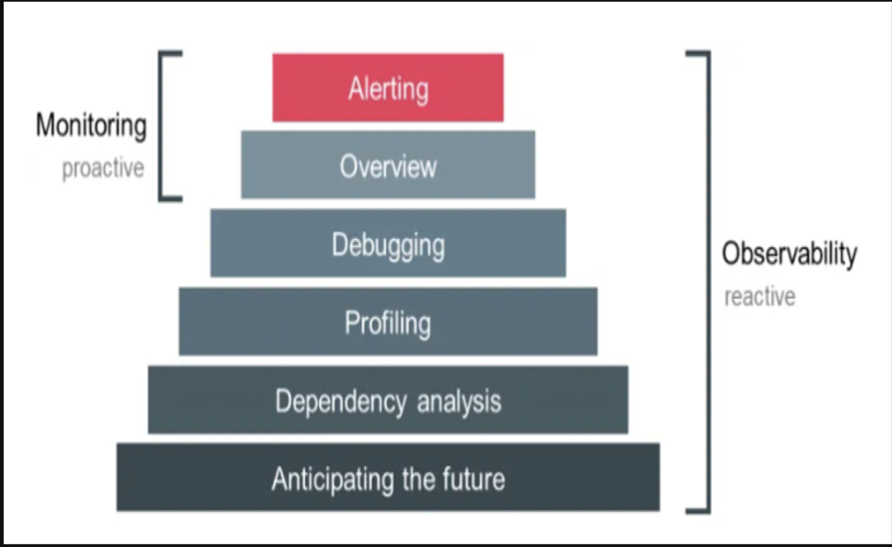
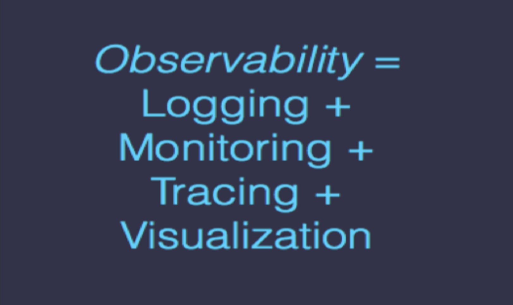
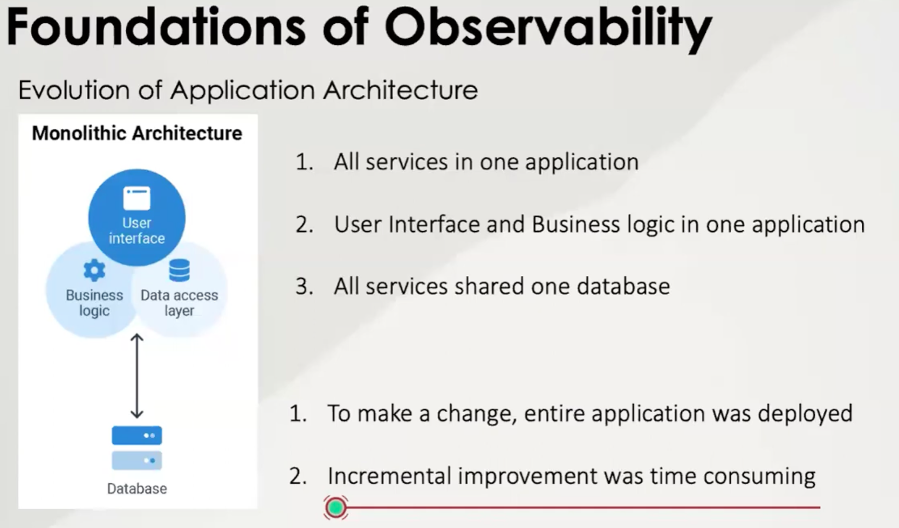
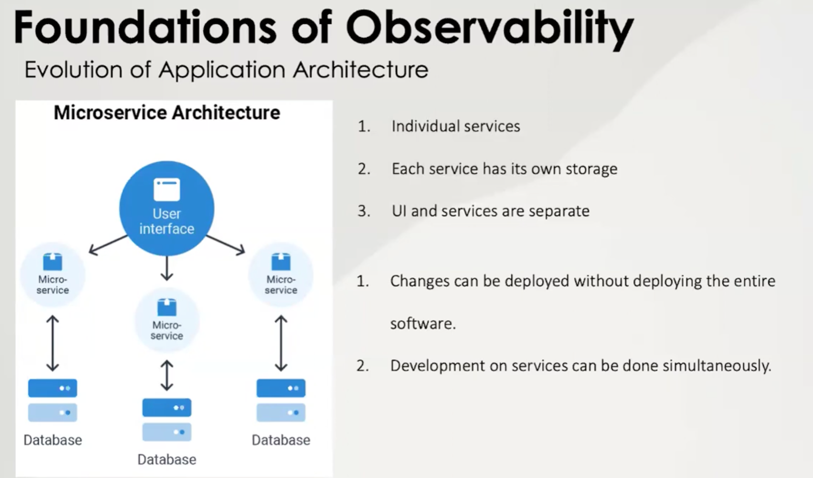
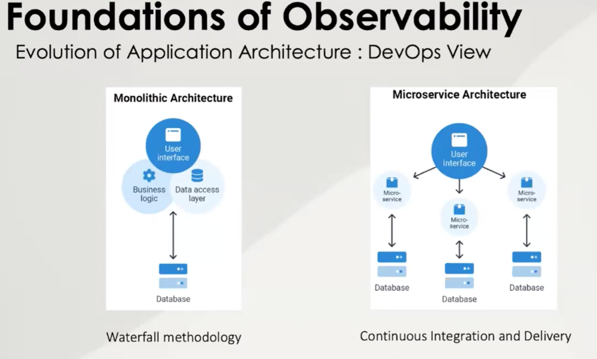
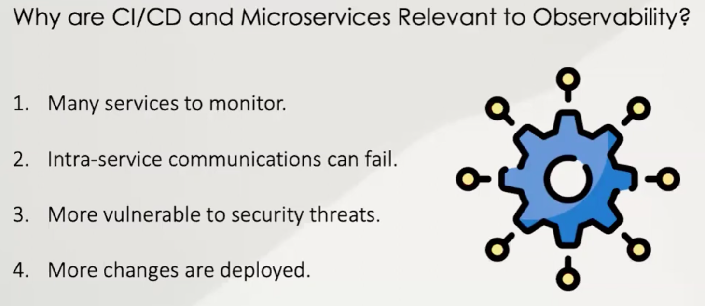

# Introduction to Monitoring and Observability
## MOnitoring
Monitoring is the most basic component in their reliability pyramid and enables incident response and postmortems. When we understand what causes problems in our services we can take steps to prevent them.

## Monitoring and Observability
Once upon a time there was “Monitoring”

Observability is a superset of monitoring. It provides not only high-level overviews of the system’s health but also highly granular insights into the implicit failure modes of the system.

In addition, an observable system furnishes ample context about its inner workings, unlocking the ability to uncover deeper, systemic issues.

Monitoring, on the other hand, is best suited to report the overall health of systems and to derive alerts.

"Monitoring tells you whether a systems is working, obserability lets you ask why it ist't working."

Monitoring systyem should address two questions: what's broken, and why?

In summary, Observability is a property of a system and Monitoring is an activety we perform on a system.

While Observability covers a larger scope, monitoring is mainly used in terms of metrics monitoring.

## These are the types of data that a system should produce to be observable.
* **Health checks**: they are often custom HTTP endpoints, help orchestrators, like Kubernetes or Cloud Foundry, they are performed to maintain the excellent health of the system.
* **Metrics**: they are a numeric representation of data that is collected at regular intervals into a time series. The Numerical time series data is straightforward to store and can query quickly; it helps when looking for historical trends.
* **Log entries**: they represent discrete events. The Log entries are essential for debugging, as they often include stack traces and other contextual information that can help identify the root cause of observed failures.
* **Distributed, request or end-to-end tracing**:  they capture the end-to-end flow of an application through the system. Tracing essentially captures both relationships between services (the services the request touched), and the structure of work through the system (synchronous or asynchronous processing, child-of or follows-from relations).

# Foundations of Observability

# Monitoring
Monitoring is collecting and visualizing data about systems regularly so the system's health cnan be viewed and tracked.

3 questions of monitoring:
1. I sthe service on?
2. Is the servive functioning as expected?
3. Is the service performing well?

The data that is collected for monitoring is called Telemetry Data.

Telemetry Data is used to find where the problem might be.

Metrics used to measure the DevOps Succes:
* MTTD - Mean Time To Detection --> Is the anount of time, on average, between the start of an issue and when teams become aware of it.
* MTTR - Mean Time To Resolve --> is the average amount of time between when an issue is detected, and when systes are fixed and operating normally.

# Methods for Monitoring
1. RED Method (Request Oriented)
    * Rate (Throughput) --> Request per second
    * Errors --> Failed requests ie HTTP 500
    * Duration --> Latency or Transaction Response Time
2. USE Method (Resource / Infrastructure Oriented)
    * Utilization --> CPU Usage %; Disk Space %
    * Stauration --> Network queue length. Zer0 euqals to Good.
    * Errors --> Disk write error. Zero euqals to Good.
3. Four Golden Signals Method (RED+S) --> From Google's Site Reliability Engineering (SRE)
    * Latency
    * Traffic (Throughput)
    * Errors
    * Saturation (Resources are 100 capacity)
4. Core Web Vitals
    * Largest Contentful Paint (Perceived page load)
    * First Input Delay (Perceived responsiveness)
    * Cumulative Layouts Shift (perceiving stability)

# Observability
* Monitoring is part of Observability.
* To use monitoring, we need to know what to monitor in advance.
* Using monitoring only results in tool sprawling.
* Observability is gathering actionable data in a way that gives a holistic view of the entire system, and tells us where, when and why an issues occurs.
* In Observability, we make sense of different types of metrics and data collected from various parts of the system.

## Types of Telemetry Data
### MELT (Metric Event Log Trace)
* Metric --> 
  * Is an aggregated value represneting events in a period of time.
  * Example: 100 bags of chips purchased every minute. 
  * Metrics are great for comparing the performance of the system with a time in the past.
* Event -->
  * An action happened at a given time
  * A bag of chips purchased at 3:20 pm.
  * Events can be found in Event Steaming platforms eg. Kafka.
  * Events validate that an expected action happened.
* Log -->
  * A very detailed representation of an event.
  * Example: Chips, Price, Purchase Time, Vending Machine ID, Location, Payment Method.
* Traces -->
  * Shows the interactions of microservices to fulfil a request.

 # Methods of Metric Collection
 ## Push and Scrape
 ### Push Method
    * Applications an dMicroservices send the metrics to an endpoint via CP; UDP; HTTP.
    * Exampe fo push is an application sending metrics to StatsD, to be stored on Graphite.
### Scrape Method
    * Applicatios amd Microservices provide APIs for the time series database, to read the metrics.
    * Prometheus uses scrpaing metrics
    * 